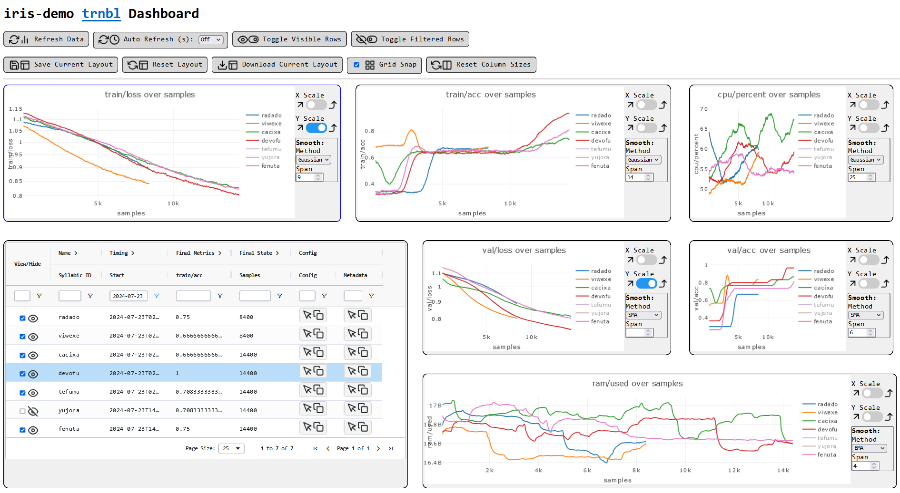

[](https://pypi.org/project/trnbl/)
<!--  -->
[](https://github.com/mivanit/trnbl/actions/workflows/checks.yml)
[](docs/coverage/coverage.txt)
<!--  -->
<!--  -->


# `trnbl` -- **Tr**ai**n**ing **B**ut**l**er

If you train a lot of models, you might often find yourself being annoyed at swapping between different loggers and fiddling with a bunch of `if batch_idx % some_number == 0` statements. This package aims to fix that problem.

Firstly, a universal interface to [`wandb`](https://github.com/wandb/wandb), [`tensorboard`](https://github.com/tensorflow/tensorboard), and a minimal local logging solution ([live demo](https://miv.name/trnbl/iris-demo/index.html)) is provided. 

- This interface handles logging, error messages, metrics, and artifacts.
- Swapping from one logger to another requires no modifications except initializing the new logger you want, and passing that instead. 
- You can even log to multiple loggers at once!

Secondly, a `TrainingManager` class is provided which handles logging, artifacts, checkpointing, evaluations, exceptions, and more, with flexibly customizable intervals.

- Rather than having to specify all intervals in batches and then change everything manually when you change the batch size, dataset size, or number of epochs, you specify an interval in samples, batches, epochs, or runs. This is computed into the correct number of batches or epochs based on the current dataset and batch size.
    - `"1/10 runs"` -- 10 times a run
    - `"2.5 epochs"` -- every 2 & 1/2 epochs
    - `(100, "batches")` -- every 100 batches
    - `"10k samples"` -- every 10,000 samples

- an evaluation function is passed in a tuple with an interval, takes the model as an argument, and returns the metrics as a dictionary

- checkpointing is handled automatically, specifying an interval in the same way as evaluations

- models are saved at the end of the run, or if an exception is raised, a `model.exception.pt` is saved

## Installation

```
pip install trnbl
```

## Usage

also see the [`notebooks/`](https://github.com/mivanit/trnbl/tree/main/notebooks) folder:
 - [`demo_minimal.py`]([notebooks/](https://github.com/mivanit/trnbl/tree/main/notebooks)demo_minimal.ipynb) for a minimal example with dummy data
 - [`demo.ipynb`]([notebooks/](https://github.com/mivanit/trnbl/tree/main/notebooks)demo.ipynb) for an example with all options on the iris dataset

```python
import torch
from torch.utils.data import DataLoader
from trnbl.logging.local import LocalLogger
from trnbl.training_manager import TrainingManager

# set up your dataset, model, optimizer, etc as usual
dataloader: DataLoader = DataLoader(my_dataset, batch_size=32)
model: torch.nn.Module = MyModel()
criterion = torch.nn.CrossEntropyLoss()
optimizer = torch.optim.Adam(model.parameters(), lr=1e-3)

# set up a logger -- swap seamlessly between wandb, tensorboard, and local logging
logger: LocalLogger = LocalLogger(
    project="iris-demo",
    metric_names=["train/loss", "train/acc", "val/loss", "val/acc"],
    train_config=dict(
		model=str(model), optimizer=str(optimizer), criterion=str(criterion)
	),
)

with TrainingManager(
	# pass your model and logger
    model=model,
    logger=logger,
    evals={
		# pass evaluation functions which take a model, and return a dict of metrics
        "1k samples": my_evaluation_function,
        "0.5 epochs": lambda model: logger.get_mem_usage(),
		"100 batches": my_other_eval_function,
    }.items(),
    checkpoint_interval="1/10 run", # will save a checkpoint 10 times per run
) as tr:

	# wrap the loops, and length will be automatically calculated
	# and used to figure out when to run evals, checkpoint, etc
    for epoch in tr.epoch_loop(range(120)):
        for inputs, targets in tr.batch_loop(TRAIN_LOADER):
			# your normal training code
            optimizer.zero_grad()
            outputs = model(inputs)
            loss = criterion(outputs, targets)
            loss.backward()
            optimizer.step()

			# compute whatever you want every batch
            accuracy = torch.sum(torch.argmax(outputs, dim=1) == targets).item() / len(targets)
            
			# log the metrics
            tr.batch_update(
                samples=len(targets),
                **{"train/loss": loss.item(), "train/acc": accuracy},
            )

	# a `model.final.pt` checkpoint will be saved at the end of the run,
	# or a `model.exception.pt` if something crashes inside the context
```


## `LocalLogger`

Intended as a minimal logging solution for local runs, when you're too lazy to set up a new `wandb` project for a quick test, and want to be able to easily read the logs. It logs everything as json or jsonl files, and provides a simple web interface for viewing the data. The web interface allows:

- enable or disable the visibility of individual runs
- filter and sort runs by various stats via an interactive table
- smooth the data and change axes scales
- move and resize all plots and tables

[You can view a live demo of the web interface here.](https://miv.name/trnbl/iris-demo/index.html)

[](https://miv.name/trnbl/iris-demo/index.html)


# TODOs:

- [ ] BUG: minifying the html/js code causes things to break?

- frontend:
	- [ ] batch/epoch size to table in config column group
	- [ ] box to add aliases to runs
	- [ ] customizable grid snap size? 
	- [ ] display the grid on the background?

- deployment:
	- [ ] demo website for local logger
	- [ ] CI/CD for website, minification, tests, etc
	- [ ] migrate to typescript