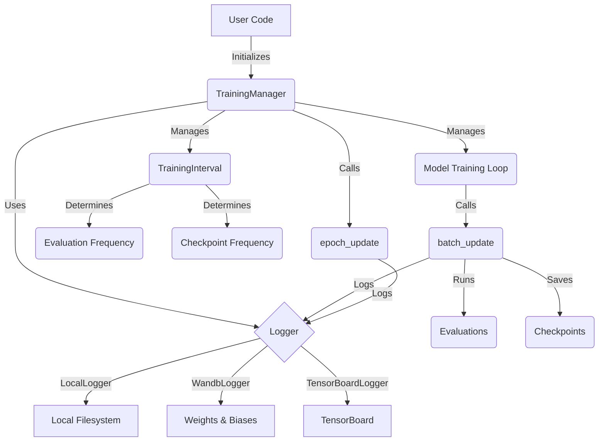

# TODO:

## Frontend:

- table:
	- [x] checkboxes on table, to mass enable/disable certain runs from being plotted
		- [x] also a "select all" checkbox to combine this with filtering
		- [x] save this with the layout?
	- [ ] box to add aliases to runs
	- [x] full config as json, copy on click

- layout:
	- [x] fix layout saving issue -- they all get bigger when loading a saved layout
	- [ ] customizable grid snap size? 
	- [ ] display the grid on the background?

- deployment:
	- [ ] demo website
	- [x] hosting of js/css files somewhere, or copy them when creating a new project?
	- [x] tests
	- [ ] CI/CD for website, minification, tests, etc
	- [x] minify the js/css:
		- https://github.com/ndparker/rcssmin
		- https://github.com/ndparker/rjsmin

- code quality:
	- [x] icons to make things pretty
	- [ ] migrate to typescript

- old:
	- [x] switch table from grid.js to ag-grid or something that has rearrangeable columns and filtering. custom filtering func might be too much effort
	- [~] settings for different units on x-axes of plots. possibly a global setting?
	- [x] figure out how to save layout -- cookies, or just a json file? (leaning towards the latter)
	- [x] once layout saving is done, have the layout be preserved when the user switches in and out of snappable resizing/moving
